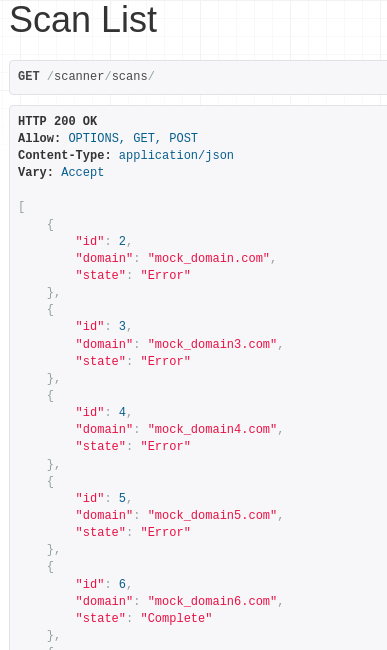
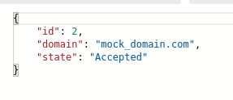
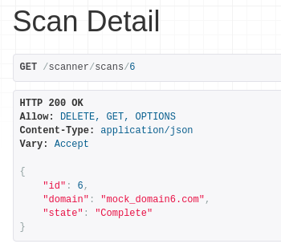
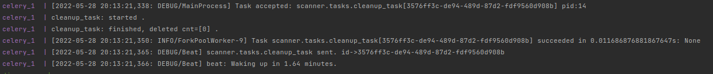

## Cyber Scanner System
Next generation of cyber scanning is here. <br>
The system consists of 4 containers: scanner, postgres, redis and celery.

## Prerequisites
* Make sure that you have Docker and Docker Compose installed
* Python 3.6 or higher, with [pip](https://pip.pypa.io/en/stable/)

## Requirements
```bash
redis==3.5.3
celery==5.0
Django==3.2.12
psycopg2-binary==2.9.1
djangorestframework==3.12.4
```

## How to run
Navigate to the project directory and run:
```bash
docker-compose up
```
## Usage
* <http://127.0.0.1:8000/scanner/scans/> <br>
1. GET all existing scans <br>

2. POST domain for a scan
```bash
curl --location --request POST 'http://127.0.0.1:8000/scanner/scans/' \
--header 'Content-Type: application/json' \
--data-raw '{"domain": "mock_domain.com"}'
```
Response:<br>
&ensp;&emsp;
* <http://127.0.0.1:8000/scanner/scans/{id}> <br> 
GET state of the scan


### How are we optimizing
1. Domain is unique.
2. When domain already exists in db in state: Running or Complete, we don't run the scan.
3. Processing of the domain implemented as async task.

### Cleaning up aged scans<br>
In order to keep our system up to date we implemented a periodic task using celery beat.
It runs every 5 minutes and removes scans that older than 20 minutes.

### TBD
1. testing
2. implementing cache
3. ngnix, gunicorn...


